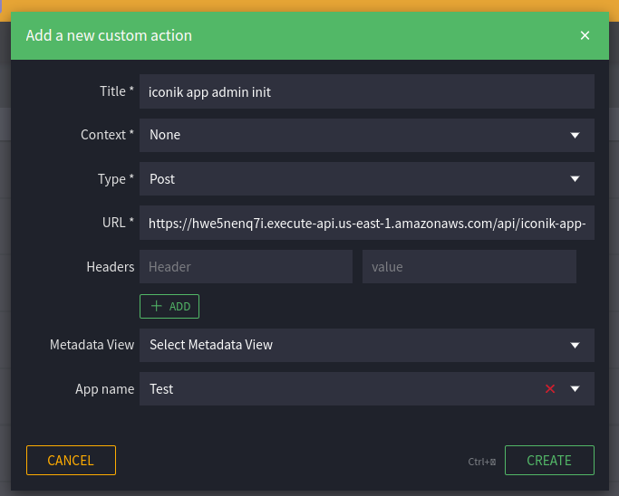

# AWS + Serverless API for your application

## Project information

It is a skeleton for your AWS + Serverless applications.

It is forked from https://github.com/first-line-outsourcing/flo.sls and all changes from parent repository can be pulled here. \
Follow these steps:

- Add `upstream` remote
  ```shell
  git remote add upstream https://github.com/first-line-outsourcing/flo.sls.git
  ```
- Pull from `upstream`
  ```shell
  git pull upstream master
  ```
- Resolve conflicts if there are some

## NPM commands

- **deploy:dev**: deploy to the AWS dev environment
- **free-up:dev**: free up AWS resources for dev stage
- **deploy:test**: deploy to the AWS test environment
- **free-up:test**: free up AWS resources for test stage
- **deploy:prod**: deploy to the AWS prod environment
- **deploy:local**: start local development environment
- **sls:package:dev**: package code using sls package command for dev stage
- **sls:package:test**: package code using sls package command for dev stage
- **sls:package:prod**: package code using sls package command for prod stage
- **sls:print:dev**: print sls config for dev stage
- **sls:print:test**: print sls config for test test
- **sls:print:prod**: print sls config for prod test
- **lint**: start tslint for project files
- **test**: start unit tests
- **test:ci**: start test in CI environment
- **sqs:up**: start Docker SQS container for local development
- **sqs:down**: stop Docker SQS container for local development
- **sqs:list-queues**: list local queues
- **sqs:create-queue**: create local queue (remove square brackets for FIFO queue)
- **sqs:receive-messages**: receive messages from local queue (remove square brackets for FIFO queue)
- **sqs:delete-queue**: delete local queue (remove square brackets for FIFO queue)
- **db:up**: start Docker Postgres container for local development
- **db:drop**: drop Postgres database
- **db:create**: create Postgres database
- **db:migrate**: migrate Postgres database
- **dynamodb:up**: start Docker DynamoDB container for local development
- **sonarqube:up**: start Docker SonarQube container for local static code analysis
- **sonarqube-verify**: start Static Code Analysis
- **containers:down**: stop all containers

## Deployment information

1. Preparation

- Install `nvm`\
  Linux, OSX: https://github.com/nvm-sh/nvm \
  Windows: https://github.com/coreybutler/nvm-windows
- Install `Node.js` _Recommended For Most Users_ version (14.17.0 for now) using nvm \
  Linux, OSX: https://github.com/nvm-sh/nvm#usage \
  Windows: https://github.com/coreybutler/nvm-windows#usage
  ```
  nvm install 14.17.0
  nvm use 14.17.0
  ```
- Install `aws-cli` version 2 \
  Linux: https://docs.aws.amazon.com/cli/latest/userguide/install-cliv2.html \
  Windows: https://docs.aws.amazon.com/cli/latest/userguide/install-cliv2-windows.html \
  OSX: https://docs.aws.amazon.com/cli/latest/userguide/install-cliv2-mac.html
- Install `Serverless framework` globally via npm \
  https://serverless.com/framework/docs/getting-started/
  ```
  npm install -g serverless
  ```
- Create AWS user with at least programmatic access. It will be better to use a user with the Admin access. Download
  user's credentials.\
  Set up `AWS credentials` according to `Serverless framework` documentation. \
  Name the profile as it named in the `env.yml -> PROFILE` field. \
  (For `local` and `dev` stages it should be `win`, for `prod` stage - name of the client) \
  https://serverless.com/framework/docs/providers/aws/cli-reference/config-credentials/
  ```
  serverless config credentials --provider aws --key ACCESS_KEY_ID --secret SECRET_ACCESS_KEY --profile PROFILE
  ```
- Install `git` https://git-scm.com/downloads
- If the repository is private you should set up SSH key or use HTTPS for cloning it
- Clone the repository
- Login to WIN's private npm account `npm login` with account from Notion `Accounts` page
  or https://damiam.atlassian.net/wiki/spaces/ICS/pages/723255313/Working+with+private+NPM+for+iconik-api
- FOR CLIENTS PERFORMING INSTALL - They can add `.npmrc` file with following info:
  ```
  //registry.npmjs.org/:_authToken=5c2a9f90-081e-459e-9400-46b5228dfe56
  ```
- Install node_modules running the command in the root of the project
  ```
  npm i
  ```

2. Set up environment variables

   - Open env.yml file, you can see stage sections here. For example, `local`, `dev`, and `prod`. If you deploy on
     production use `prod` section and do not touch other sections.
   - Input your AWS region, for example, `us-east-1`
   - Go to AWS Console `Key Management Service` and create Symmetric key in your region
   - In the root folder of the project create kms_key.yml file and copy your key (Key ID) here like
     ```
     ${stage}: your_key_here
     ```
     Where stage can be `local`, `dev`, `test` and `prod`
   - You can add any environment variables. If you need to secure them, encrypt them. Check FAQ section of this document for useful information about `env.yaml` and Serverless stage parameters.

   - Copy the value of variable and run the command in the root of the project
     ```
     sls env --attribute VARIABLE_NAME --value variable_value --stage your_stage --encrypt
     ```
   - If you use some common variables, like

     ```yaml
     common: &common
       MY_SHARED_VAR: <encrypted content>

     local:
       <<: *common
     ```

The plugin will add these variables to all stages, but we don't want it. So after encrypting, copy encrypted value of
the new variable, revert changes and paste it to the right place.

- Go to the iconik and create app with name `WIN Automation`. You should choose the admin user for this app. If the
  app already exists, use it.
- Copy app id and run the command in the root of the
  project `sls env --attribute ICONIK_APP_ID --value your_app_id --stage prod --encrypt`. Do not forget to do the
  step `If you use some common variables`.
- Copy auth token and run the command in the root of the
  project `sls env --attribute ICONIK_AUTH_TOKEN --value your_auth_token --stage prod --encrypt`. Do not forget to do
  the step `If you use some common variables`.
- You are ready for deploying

3. Deploy

- Run the command in the root of the project
  ```
  npm run deploy:your_stage
  ```

4. Set up features

- After successful deployment you will see the API URLs. Copy the URLs that ends on `/initialization`, post them to
  the browser URL input and click enter. They will create all needed stuff in your iconik account.

### Freeing up AWS resources

When there is no dev tasks for the project very long time you can free up AWS resources of the project. It helps to reduce total cost for AWS resources on dev account.

To free up resources use `npm run free-up:<stage>` command. Where `<stage>` is a stage you are going to free up resources for.

When you run the command it uses `serverless.free-up-resources.ts` config to deploy sls application. The config contains minimum set of resources(REST API, HTTP API resources, etc.) for stage to keep ability to deploy it next time without changing anything. Feel free to edit the config for your case. If your project uses only HTTP API then keep the `HttpApi` resources in the config, if it is REST API then keep the `ApiGatewayRestApi` resources.

## The project contains:

- The Media Info feature that uses mediainfo binary file and returns media info by url
- Examples of offline plugins and docker-compose file for working with AWS resources offline
- Examples of HTTP API and REST API endpoints with authorizers
- Examples of IAM Role Statements
- Example of different AWS resources
- Examples of models for dynamoose library
- Examples of models for sequelize library
- Examples of services for working with AWS resources
- Simple CircleCI configuration

## iconik Resources

### Feature Name

#### Metadata Views

- **View Name** - Metadata for the collection/asset/Custom Action for saving some data. \
  Also, it's used in iconik search. \
  Fields:

  - win_FieldName - Description
  - win_FieldName2 - Field for saving the asset's status

- **View Name 2** - Metadata for the collection/asset/Custom Action for saving some data. \
  Fields:

  - win_FieldName3 - Description
  - win_FieldName4 - Field for saving the asset's job ID

#### Metadata Fields (aren't included in any views)

- win_FieldName - It's used for saving some settings

#### Webhooks

- **Webhook Name** `api/webhook-url` - It triggers when the asset is added to iconik. \
  It adds information about the asset to the DynamoDB table that is scanned by WINTrayToolset.

#### Custom Actions

- **Custom Action Name** `api/custom-action-url` - Description

### Feature Name 2

#### Custom Actions

- **Custom Action Name 2** `api/custom-action-url-2` - It starts transcription process

## Project structure

- .circleci - Configuration for CI/CD
- api - Code of the features or CRUD operations of entities
  - feature_name - Code of one feature or CRUD operations of one entity. It should cover the area of one
    responsibility. For example, Media Info feature, CRUD operations (create, remove, update, delete) for user entity
    - handler.ts - This is a handler file. It should contain Lambda functions for one feature. For example, Media
      Info feature or CRUD operations for the user entity.
    - feature_name.manager.ts - It's the feature manager. Its methods should implement some feature's functionality
    - feature_name.service.ts - It's the feature service. Its methods should implement one of the main steps of some
      feature's functionality
    - feature_name.interface.ts - This file should contain all required interfaces for the feature
- bin - Executable files (third party libraries that can be used inside a Lambda function)
- config - Folder for configurations
  - serverless - TypeScript files for the description of Serverless resources
    - parts - TypeScript files for the description of Lambda function with their triggers and resources like S3 buckets, SQS, DynamoDB tables, etc.
      - examples.ts - TypeScript file for description Lambda functions with their triggers for one feature
      - feature.ts - TypeScript file for description Lambda functions with their triggers for one feature
      - rest-api-cors.ts - Helper for setting up CORS for REST API
      - jobs.ts - TypeScript file for description of DynamoDB table
      - users.ts - TypeScript file for description of DynamoDB table
    - cf-intristic-fn.ts - Helper with function for CloudFormation
    - types.ts - Types for Serverless configurations
    - utils.ts - Helper for Serverless configurations
- helper - All auxiliary code
  - http-api/ - Helpers for HTTP API
  - rest-api/ - Helpers for REST API
  - base-error-handler.ts - Base for building error handlers. Normally you should not use it in lambda.
  - environment.ts - Helper for working with environment variables
  - helper.ts - This file contains auxiliary functions
  - logger.ts - This file contains log function that helps log data in the proper way
- interfaces
- models - Models for the databases
  - DynamoDB
    - user.model.ts
    - job.model.ts
  - PostgreSQL
    - account.model.ts
    - domain.model.ts
- services - Classes for working with third party libraries, APIs, services, etc.
  - cloud-formation.service.ts
  - email.service.ts
  - s3.service.ts
- docker-compose.yml
- env.yml - Environment variables
- package.json
- README.md
- serverless.ts - Contains the main description of the service
- sonar-project.properties - Contains the configuration for static code analysis
- tsconfig.json
- loadenv.ts - load environment variable from `.env` file
- esbuild-pluings.js - load pluings for esbuild

## Static code analysis

- Start SonarQube docker container with command `npm run sonarqube:up`
- Start tests with command `npm run test`
- Start analysis with command `npm run sonarqube-verify`
- Go to http://localhost:9000
- Log in with _admin/admin_ credentials
- Now you can see the project's report

### Troubleshooting

- If you see the error `Not authorized. Analyzing this project requires authentication. Please provide a user token in sonar.login or other credentials in sonar.login and sonar.password.`,
  go to the `Administration` menu in the header -> `Security` -> scroll down and turn off `Force user authentication`.
  Do it for local usage only!

## How to add env variable

In project used https://github.com/org-redtea/serverless-env-generator that fork of https://github.com/DieProduktMacher/serverless-env-generator.

Some caveats:

- Shorthand `-v` does not work for both original plugin and forked.
- Shorthand `-c` does not work

Add kms_key.yml file with `${stage}` field and your KMS Id to the root.
For example:

```YAML
local: xxx
dev: xxx
test: xxx
prod: xxx
```

### In short:

#### Viewing environment variables

Use the following commands to read and decrypt variables from your YAML environment files:

#### List variables

```sh
serverless env
serverless env --stage $STAGE
```

#### View one variable

```sh
serverless env --attribute $NAME
serverless env --attribute $NAME --stage $STAGE

#shorthand:
sls env -a $NAME
sls env -a $NAME -s $STAGE
```

#### Decrypt variables

```sh
serverless env --decrypt
serverless env --attribute $NAME --decrypt
serverless env --attribute $NAME --stage $STAGE --decrypt

#shorthand:
sls env -a $NAME --decrypt
sls env -a $NAME -s $STAGE -d
```

#### Setting environment variables

Use the following commands to store and encrypt variables in your YAML environment files:

Note that variables are stored to the first file listed in _envFiles_.

#### Set a variable

```sh
serverless env --attribute $NAME --value $PLAINTEXT
serverless env --attribute $NAME --value $PLAINTEXT --stage $STAGE

#shorthand:
sls env -a $NAME --value $PLAINTEXT
sls env -a $NAME --value $PLAINTEXT --s $STAGE
```

#### Set and encrypt a variable

```sh
serverless env --attribute $NAME --value $PLAINTEXT --encrypt
serverless env --attribute $NAME --value $PLAINTEXT --stage $STAGE --encrypt

#shorthand:
sls env -a $NAME --value $PLAINTEXT -e
sls env -a $NAME --value $PLAINTEXT -s $STAGE -e
```

#### Set value of attribute in anchor

```sh
serverless env --anchor $ANHOR --attribute $NAME --value $PLAINTEXT

#shorthand:
sls env --anchor $ANHOR -a $NAME --value $PLAINTEXT
```

Let\`s assume we have the following `env.yml`:

```YAML
common:
  &common
  VAR: "1"

local:
  <<: *common
dev:
  <<: *common

test:
  <<: *common

prod:
  <<: *common
```

The result of the command:

```bash
$ sls env --attribute VAR --anchor common --value 2
```

will be:

```YAML
common:
  &common
  VAR: "2"

local:
  <<: *common
dev:
  <<: *common

test:
  <<: *common

prod:
  <<: *common
```

## Iconik app token

Iconik App ID and Auth token is stored in the SSM parameters storage. To get or update token use `IconikCredentialsStorage` service:

```typescript
// helper/example.ts
import { IconikCredentialsStorage } from '../services/IconikCredentialsStorage';

async function printIconikCredentials() {
  const storage = new IconikCredentialsStorage();
  console.log(await storage.get());
}
```

You can change iconik APP ID or APP AUTH TOKEN in the [SSM parameters store](https://docs.aws.amazon.com/systems-manager/latest/userguide/systems-manager-parameter-store.html). The path patterns:

- /win/{CLIENT_NAME}/{SERVICE_NAME/{STAGE}/iconik-credentials/{VARIABLE_NAME}

Where:
- CLIENT_NAME - value of `CLIENT` variable from `env.yaml`
- SERVICE_NAME - value of `service` field of the sls config
- STAGE - stage name: dev/prod/test/etc
- VARIABLE_NAME - can be: app-id, app-auth-token

Those parameters are created on first deployment(check the `init-deploy.js` script), so you don`t have to create them by hands.

## Iconik app admin

Iconik app admin is build-in feature to manage iconik app related things like token management. 

Current list of what it does:

- Provide an iconik custom action to update iconik app id and app auth token in the SSM parameter store.

To install into an iconik domain go to the iconik domain custom actions admin panel and add the following custom action:


- URL = `{BASE_API_URL}/api/iconik-app-admin/init`
- App name = name of the app you used to deploy the service

Then trigger the init custom action and wait some time. It adds **[{SERVICE_NAME}:{STAGE}] Update app token** metadata view and **[{SERVICE_NAME}:{STAGE}] Update app token** custom action. Remove the init custom action from custom actions list.

You can use the **Update app token** custom action to update app token.

Required dependencies:
- `api/iconik-app-admin/*`
- `services/IconikCredentialsStorage.ts`
- `authorizers/iconik/custom-action.ts`
- `helper/authorizers/iconik/context.ts`
- `helper/environment.ts`
- `helper/axios.ts`
- `interfaces/api-gateway-lambda.interface.ts`
- `interfaces/api-gateway-authorizer.interface.ts`
- `config/serverless/parts/iconik-app-admin.ts`
- `scripts/init-deploy.js` - add pre-script to each deploy command in the `package.json`: `"predeploy:<stage>": "node scripts/init-deploy.js <stage>",`
- `@workflowwin/iconik-api` package
- `@floteam/errors` package
- `@redtea/format-axios-error` package
- `axios` package
- `node-cache` package
- `@types/aws-lambda` package

All code of the iconik app admin is here: `api/iconik-app-admin/`.


## FAQ

### What type of API Gateway event to use for lambda: REST API or HTTP API?

In most cases HTTP API is the best and cheapest choice. So, use it.
In other cases you should check [this page](https://docs.aws.amazon.com/apigateway/latest/developerguide/http-api-vs-rest.html) to find out what to choose. There are a lot of differences between HTTP API and REST API.

- About REST API event in serverless docs. [Link](https://www.serverless.com/framework/docs/providers/aws/events/apigateway/).
- About HTTP API event in serverless docs. [Link](https://www.serverless.com/framework/docs/providers/aws/events/http-api/)

### "Serverless Offline only supports retrieving JWT from the headers (undefined)" error when trying to start offline

Probably, you use lambda authorizer for HTTP API. Serverless offline plugin does not support for that yet. Check the plugin repo for any updates.


### What to use: `env.yml` or [params](https://www.serverless.com/framework/docs/guides/parameters#stage-parameters)?

With [Serverless stage parameters](https://www.serverless.com/framework/docs/guides/parameters#stage-parameters) you can pass different value of a parameter depending on the stage to the serverless config. You can use it as values source for env variables for lambda like this:

```typescript
const serverelssConfig: AWS = {
  ...
  params: {
    dev: {
      MY_PARAM: '1',
    },
    prod: {
      MY_PARAM: '2',
    },
  },
  provider: {
    environment: {
      MY_PARAM: '${param:MY_PARAM}',
    },
  },
  ...
}
```

With `env.yml` you can store encrypted env variables and any env variables that will be passed to lambda on deploy. You can use it even in the serverless config as parameter like this:

```typescript
const serverelssConfig: AWS = {
  ...
  provider: {
    tags: {
      MY_TAG: `${file(./env.yml):${self:provider.stage}.MY_TAG}`,
    },
  },
  ...
}
```

In this case `MY_TAG` will be passed to lambda too. If you don\`t want that happens then use the stage parameters instead.

Here is some recommendations you may follow in you project:

- Use the stage parameters to substitute values in the serverless config. Those parameters will not be passed to lambda and only visible in the serverless config.
- Use `env.yml` to store encrypted env variables / encrypted parameters / any env variable or parameter. Keep in mind that all variables/parameters in the yml file will be passed to each lambda as env variables.
- Use the stage parameters as values source for lambda env variables if you have only a few variables.


